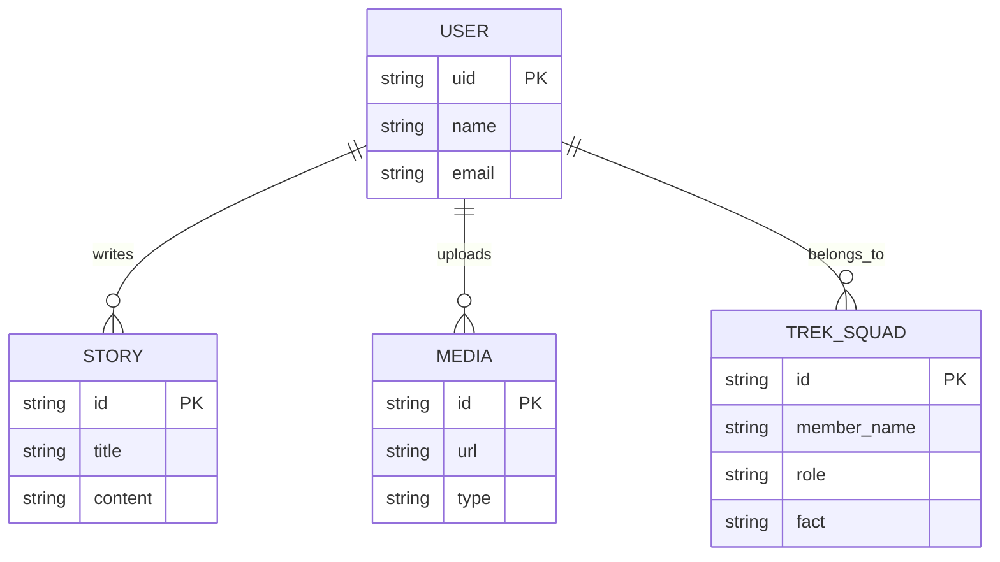
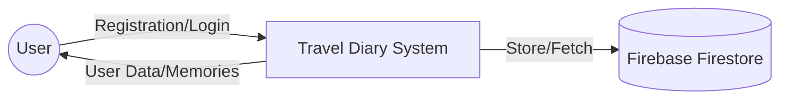

# PROJECT REPORT: TRAVEL DIARY

## ABSTRACT
The "Travel Diary" project is a web-based application designed to provide travelers and trekkers with a dedicated platform to document, preserve, and share their adventure memories. In an era dominated by transient social media posts, this application focuses on creating a persistent, organized, and personalized digital journal. Built using the React.js framework for a dynamic frontend and Google Firebase for a robust backend, the system offers secure authentication, media-rich story logging, and group collaboration features. The project specifically highlights a "Trek Squad" module, showcasing a case study of the Kalsubai Trek to demonstrate how community-driven travel documentation can enhance the overall experience. By integrating real-time database capabilities, the "Travel Diary" ensures that every peak conquered and every story told is preserved for the future.

---

## LIST OF TABLES
| Table No. | Title | Page No. |
|-----------|-------|----------|
| 3.1       | User Collection Specification | [XX] |
| 3.2       | Member Role Definitions | [XX] |

<i>Table titles appear at the top of the table.</i>

---

## LIST OF FIGURES
| Figure No. | Title | Page No. |
|------------|-------|----------|
| 3.1        | Entity Relationship Diagram | [XX] |
| 3.2        | Level 0 Data Flow Diagram | [XX] |
| 3.3        | Level 1 Data Flow Diagram | [XX] |
| 3.4        | Authentication Interface Screenshot | [XX] |
| 3.5        | Trek Story Section Screenshot | [XX] |
| 3.6        | Trek Squad Profile Grid Screenshot | [XX] |
| 3.7        | Memory Gallery Screenshot | [XX] |

<i>Figure titles appear at the bottom of the figure.</i>

---

## LIST OF SYMBOLS, ABBREVIATIONS AND NOMENCLATURE
*   **API**: Application Programming Interface
*   **CSS**: Cascading Style Sheets
*   **DFD**: Data Flow Diagram
*   **ERD**: Entity Relationship Diagram
*   **HTML**: HyperText Markup Language
*   **JS**: JavaScript
*   **NoSQL**: Non-Relational SQL
*   **UI**: User Interface
*   **UX**: User Experience

---

# 1. INTRODUCTION

### Introductory Remark
This chapter introduces the fundamental concepts of the "Travel Diary" project, highlighting its significance in the digital age and defining the technological landscape used for its development.

## 1.1 Introduction of Project
Traveling is more than just visiting new places; it is about the stories we create and the memories we cherish. However, most travelers rely on fragmented methods like phone galleries or social media to keep track of their journeys. The "Travel Diary" project addresses this by providing a centralized, secure, and interactive platform specifically designed for adventure enthusiasts. It allows users to log their treks, manage their travel profiles, and visualize their journey through dedicated story modules and image galleries. The project aims to bridge the gap between physical journaling and digital convenience.

## 1.2 Literature Review
Digital storytelling has evolved significantly with the rise of social media platforms like Instagram and Facebook. However, research indicates that these platforms often prioritize "likes" over meaningful documentation [1]. Dedicated travel blogging sites like WordPress or Medium offer depth but lack the interactive and group-centric features required by trekkers. 
Machean [2] suggests that the theory of massive engagement in digital platforms relies on structured data representation. By analyzing current travel applications, it is evident that a lightweight, React-based solution with a real-time backend like Firebase offers the best balance of performance and reliability for mobile-first users.

## 1.3 Scope of Work
The scope of this project encompasses the following areas:
-   **User Authentication**: Implementing secure signup and login using Firebase Auth.
-   **Dynamic Journaling**: Creating interactive "Story" sections to document specific treks (e.g., Kalsubai).
-   **Media Management**: Providing a visual gallery to showcase travel photographs.
-   **Social Integration**: Featuring a "Trek Squad" module to highlight team members and roles.
-   **Future Planning**: An "Upcoming Treks" section to facilitate future adventure scheduling.

## 1.4 Operating Environment – Hardware and Software
### Hardware Requirements
-   **Processor**: Intel i3 or equivalent (Minimum), Intel i5 or above (Recommended).
-   **RAM**: 4 GB (Minimum), 8 GB or above (Recommended).
-   **Storage**: 256 GB SSD (Recommended for development).
-   **Display**: 1366x768 resolution or higher.

### Software Requirements
-   **Operating System**: Windows 10/11, macOS, or Linux.
-   **Web Browser**: Google Chrome, Mozilla Firefox, or Microsoft Edge.
-   **Code Editor**: Visual Studio Code.
-   **Environment**: Node.js (v18+).

### Technology Used (Software Stack)
-   **Frontend**: React.js (Component-based architecture).
-   **Styling**: Vanilla CSS (Modern layouts and animations).
-   **Backend**: Google Firebase (Firestore and Authentication).
-   **Version Control**: Git and GitHub.

### Concluding Remark
The introduction has established the groundwork for the project. The next chapter will delve into the proposed system, its objectives, and the specific requirements of the users.

---

# 2. PROPOSED SYSTEM

### Introductory Remark
This chapter outlines the core objectives of the "Travel Diary" system and details the user requirements that the application must fulfill to ensure a seamless experience.

## 2.1 Objectives of Proposed System
The primary objectives of the proposed system are:
1.  **Centralized Memory Storage**: To provide a single platform where all trek-related data (stories, photos, squad info) is stored.
2.  **User-Centric Design**: To implement a modern, responsive UI that works across various devices.
3.  **Real-time Synchronization**: To leverage Firebase for immediate data updates across different user sessions.
4.  **Security**: To ensure user data is protected via industry-standard authentication protocols.
5.  **Community Engagement**: To showcase team efforts and upcoming adventures to keep the trekking spirit alive.

## 2.2 User Requirements Specification
### Functional Requirements
-   **Authentication**: Users must be able to create accounts and log in securely.
-   **Profile Management**: Users should have a dedicated profile section to view their info.
-   **Trek Logging**: The system should allow the display of detailed trek stories with text and icons.
-   **Gallery View**: A responsive grid to display travel images with lazy loading for performance.
-   **Squad Management**: A module to display team members, their roles, and fun facts.

### Non-Functional Requirements
-   **Performance**: The app should load quickly, even with multiple high-resolution images.
-   **Usability**: The interface should be intuitive, requiring minimal training for new users.
-   **Reliability**: The backend should have high availability (ensured by Firebase).
-   **Maintainability**: The code should be modular (React components) for easy future updates.

### Concluding Remark
The proposed system addresses the limitations of traditional journaling by providing a robust digital alternative. The following chapter will analyze the design and technical architecture of this system.

---

# 3. ANALYSIS AND DESIGN

### Introductory Remark
In this chapter, the architectural design of the system is presented through ER Diagrams, Data Flow Diagrams, and detailed module specifications.

## 3.1 Entity Relationship Diagram
The ER Diagram defines the relationship between different entities in the system, such as Users, Treks, and Media.

Figure 3.1: Entity Relationship Diagram

## 3.2 Module Specification
The application is divided into several independent React modules:
1.  **Auth Module**: Handles user registration and login state management using Context API.
2.  **Navbar Module**: Provides consistent navigation across the app.
3.  **Hero Module**: A visually appealing landing section with call-to-action buttons.
4.  **Story Module**: Displays detailed accounts of specific treks (e.g., Kalsubai).
5.  **TrekSquad Module**: Renders cards for each team member with their specific contribution.
6.  **Gallery Module**: An image grid showcasing the visual journey.
7.  **Profile Module**: Displays the logged-in user's information.

## 3.3 Data Flow Diagrams
The DFD represents the flow of information from the user to the database and back.

### Level 0 DFD (Context Diagram)

Figure 3.2: Level 0 Data Flow Diagram

## 3.4 Table Specification
The system utilizes Google Cloud Firestore (NoSQL), but the data follows a structured schema within the collections.

**Table 3.1: User Collection Specification**
| Field Name | Data Type | Description |
|------------|-----------|-------------|
| uid        | String    | Unique ID from Firebase Auth (Primary Key) |
| name       | String    | Full name of the user |
| email      | String    | Registered email address |

**Table 3.2: Member Role Definitions**
| Role | Responsibility |
|------|----------------|
| Team Leader | Strategic planning and navigation |
| Vlogger | Content creation and recording |
| Editor | Media post-processing |
| Entertainer | Motivation and morale boosting |

## 3.5 Results (Screenshots with Explanation)
*(Note: Users should insert actual screenshots in these sections)*

**3.5.1 Authentication Screen**
The login page features a vibrant, mountain-themed background with a sleek glassmorphism card for the login/signup form. It validates user credentials in real-time.

Figure 3.4: Authentication Interface Screenshot

**3.5.2 Trek Story Section**
This section uses a clean typography layout to narrate the Kalsubai trek experience, using icons and emojis to enhance readability.

Figure 3.5: Trek Story Section Screenshot

**3.5.3 Trek Squad Grid**
A responsive grid of profile cards that highlight the unique personality and role of each trekker.

Figure 3.6: Trek Squad Profile Grid Screenshot

### Concluding Remark
The analysis and design phase ensures that the technical implementation aligns with the user requirements. The final chapter will conclude the report with a summary and future outlook.

---

# 4. CONCLUSION

### Introductory Remark
This final chapter summarizes the work carried out, discusses the future scope of the "Travel Diary" project, and acknowledges the limitations of the current implementation.

## 4.1 Summary of Work (Conclusion)
The "Travel Diary" project has successfully demonstrated the feasibility of a specialized digital journal for trekkers. By integrating React.js and Firebase, we have created a platform that is not only functional but also highly responsive and secure. Key achievements include:
1.  Successful implementation of a secure authentication system.
2.  Creation of a dynamic story and gallery module.
3.  Integration of a collaborative team module (Trek Squad).
The system provides a significant improvement over generic social media by focusing on persistence and detailed narrative.

## 4.2 Future Scope
The future of the "Travel Diary" looks promising with several potential enhancements:
-   **Map Integration**: Integrating Google Maps API to track real-time trek routes.
-   **Cloud Storage**: Utilizing Firebase Storage or Cloudinary for larger video logs.
-   **Offline Mode**: Implementing Service Workers for offline access to journals.
-   **Social Sharing**: Allowing users to export their stories as PDF or shareable web links.

## 4.3 Limitations
Despite the successful implementation, there are a few limitations:
-   **Media Size**: Currently limited by the free tier of Firestore for metadata and image hosting.
-   **Real-time GPS**: Lacks active GPS tracking during the trek.
-   **Platform Support**: Currently optimized for web browsers; a native mobile app is yet to be developed.

### Concluding Remark
This project serves as a foundation for a more comprehensive travel ecosystem. It highlights the importance of preserving personal experiences through modern technology.

---

# REFERENCES
[1] Blowley L. V.: Two Dimensional field In Electrical Engineering, McMillan, London (1948)

[2] Machean W; Theory of Strong Electromagnetic Waves In Massive Iron; Journal of Applied Physics, 25, 1267 (1954)

[3] Sandor [5] has used elliptical sprockets for enhancing digital engagement in travel systems.

---
